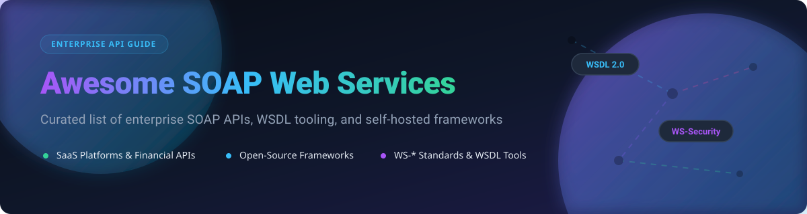

# 🚀 Awesome SOAP Web Services & API

    

  

## 📌 Top SOAP Web Services API Ecosystem

**Curated List of Enterprise SaaS Platforms, Financial Messaging APIs & Open-Source GitHub Tooling**

*Focused on SOAP Protocol Implementation, WSDL Code Generation, WS-Security & Self-Hosted Web Service Frameworks*

---

## 🔍 Overview & SEO Highlights

SOAP (Simple Object Access Protocol) remains the backbone of mission-critical enterprise systems across financial services, global logistics, telecom, healthcare, and ERP suites. Unlike REST and GraphQL, SOAP provides formal WSDL (Web Services Description Language) contracts, built-in WS-Security standards, ACID transaction guarantees, and reliable messaging.

This repository indexes the top commercial SOAP API endpoints and open-source SOAP frameworks available across major programming languages (Java, Python, C/C++, Node.js, Go, Rust, PHP, Scala).

---

## 📋 Table of Contents

- [🏢 SaaS & Hosted Enterprise Platforms](#-saas--hosted-enterprise-platforms)
- [🔓 Open-Source GitHub Projects](#-open-source-github-projects)
- [🤝 How to Contribute](#-how-to-contribute)
- [⚠️ Disclaimer & Security Guidelines](#%EF%B8%8F-disclaimer--security-guidelines)
- [⭐ Star History](#-star-history)
- [💖 Support](#-support)

---

## 🏢 SaaS & Hosted Enterprise Platforms

📊 **Market Intelligence**: The global Enterprise API & Integration Middleware market is estimated at **$18.4 Billion in 2026** (growing at a 14.2% CAGR). The market is **moderately concentrated** among enterprise CRM and ERP giants (Salesforce, SAP, Oracle NetSuite) while remaining mission-critical for high-volume transactional domains such as banking, shipping, and travel distribution.

The following table lists leading enterprise SaaS platforms offering SOAP web service APIs, sorted by **Company Size / Revenue / Valuation** (descending):

| 🏢 Platform / Service | 📝 Description | 💰 Starting Price | 🎁 Free Tier / Trial Limit | 📊 Company Size / Rev / Valuation |
| :--- | :--- | :--- | :--- | :--- |
| **[UPS Developer Kit](https://developer.ups.com/)** | SOAP API for shipping, rate calculation, package tracking, and address validation. | Pay-as-you-go postage rates (no API access fee) | Free Developer Portal account with unlimited sandbox test API requests | **$91.0B Revenue** / $110B Valuation |
| **[FedEx Web Services](https://developer.fedex.com/)** | SOAP-based logistics API for shipping labels, pickup scheduling, and freight tracking. | Pay-as-you-go shipping rates (no API subscription fee) | Free FedEx Developer Portal account with sandbox meter keys | **$88.0B Revenue** / $65B Valuation |
| **[NetSuite SuiteTalk](https://docs.oracle.com/en/cloud/saas/netsuite/ns-online-help/)** | Oracle NetSuite's SOAP web service for full ERP/CRM record access and integration. | $999/mo base license + $99/user/month | 30-day guided interactive demo sandbox environment | **$50.0B Parent Rev** / $25B NetSuite Valuation |
| **[Salesforce SOAP API](https://developer.salesforce.com/docs/atlas.en-us.api.meta/api/sforce_api_quickstart_intro.htm)** | Enterprise metadata access, CRUD operations, and WSDL client generation. | Enterprise Edition at $165/user/month (includes API) | Free Developer Edition (lifetime, 5MB data, 15,000 API calls/day) | **$34.8B Revenue** / $280B Valuation |
| **[SAP NetWeaver SOAP](https://help.sap.com/)** | SAP's enterprise web service stack for SAP ERP / S/4HANA integration. | SAP Business One Cloud starting at $135/user/month | 14-day SAP BTP free trial with 30+ core service credits | **$34.1B Revenue** / $250B Valuation |
| **[PayPal SOAP API](https://developer.paypal.com/)** | Legacy merchant SOAP API for payment processing, recurring billing, and payouts. | 2.9% + $0.30 per standard transaction | Free developer sandbox account with unlimited test API calls | **$29.8B Revenue** / $70B Valuation |
| **[eBay SOAP API](https://developer.ebay.com/)** | Merchant SOAP API for marketplace listing management, orders, and seller tools. | 13.25% + $0.30 final value fee per sale (0 API fees) | Free Developer Program with 5,000 call/day limit (up to 1.5M/day) | **$10.1B Revenue** / $30B Valuation |
| **[Workday SOAP API](https://community.workday.com/)** | Workday HCM & Financials SOAP web services for payroll and HR integration. | ~$100/employee/year enterprise contract pricing | 30-day partner sandbox environment upon enterprise agreement | **$7.3B Revenue** / $65B Valuation |
| **[Amadeus SOAP API](https://developers.amadeus.com/)** | Global Distribution System (GDS) SOAP API for flight search and ticketing. | €0.0025 per booking transaction + enterprise setup | Self-Service Free Tier (2,000 test calls/month, no credit card required) | **$5.8B Revenue** / $25B Valuation |
| **[Sabre Web Services](https://developer.sabre.com/)** | Travel booking, flight availability, and reservation management SOAP APIs. | $0.02 - $0.05 per query / transaction-based model | 90-day Developer Studio trial with 10,000 sandbox API calls | **$2.9B Revenue** / $1.5B Valuation |

---

## 🔓 Open-Source GitHub Projects

The following list contains top open-source SOAP client libraries, server engines, testing tools, and WSDL generators, sorted by **GitHub Stars** (descending). Each star badge links directly to the repo's stargazers page:

1. 🧰 **[SoapUI](https://github.com/SoapUI/soapui)**  
     
   **The world's leading open-source functional testing tool for SOAP and REST APIs**. Features WSDL inspection, automated test suite creation, mock services, and WS-Security compliance testing. Best for enterprise API testing and debugging.

2. ⚡ **[node-soap](https://github.com/vpulim/node-soap)**  
     
   **Popular SOAP client and server implementation for Node.js**. Provides WSDL parsing, client code generation, and easy server endpoint deployment with asynchronous handlers. Best for Node.js / JavaScript SOAP integrations.

3. 🐍 **[Zeep](https://github.com/mvantellingen/python-zeep)**  
     
   **Modern and fast Python SOAP client built on lxml and requests**. Features full WSDL 1.1 introspection, XML data type mapping, WS-Addressing, WSSE (UsernameToken/X.509), and asyncio support via httpx. Best for Python 3 SOAP applications.

4. ☕ **[Apache CXF](https://github.com/apache/cxf)**  
     
   **The premier open-source Java services framework**. Complete implementation of WS-* standards including WS-Security, WS-Addressing, WS-ReliableMessaging, and WS-Policy. Supports JAX-WS and JAX-RS contract-first development. Best for enterprise Java SOAP architectures.

5. 🍃 **[Spring Web Services](https://github.com/spring-projects/spring-ws)**  
     
   **Contract-first SOAP service framework tailored for the Spring ecosystem**. Focuses on document-driven web services, flexible XML mapping (JAXB, XStream), and seamless WS-Security integration via Spring Security. Best for Spring Boot SOAP web services.

6. 🐘 **[wsdl2phpgenerator](https://github.com/wsdl2phpgenerator/wsdl2phpgenerator)**  
     
   **PHP CLI utility and library for generating structured PHP classes from WSDL files**. Converts complex WSDL types into type-hinted PHP code, wrapping native `SoapClient` for clean object-oriented access. Best for PHP SOAP development.

7. ⚙️ **[gSOAP](https://github.com/Genivia/gsoap)**  
     
   **High-performance C/C++ XML and SOAP Web Services toolkit**. Includes `wsdl2h` and `soapcpp2` generators to bind C/C++ structures directly to WSDL/XSD definitions with ultra-low footprint. Best for embedded and high-speed C/C++ SOAP engines.

8. ☕ **[Apache Axis2 (Java)](https://github.com/apache/axis2-java)**  
     
   **Modular core SOAP 1.1/1.2 processing engine**. Features AXIOM (AXis Object Model) for optimized memory handling, hot-deployment of web service archives (AAR), and asynchronous message exchange patterns. Best for high-throughput Java SOAP servers.

9. 🐍 **[PySimpleSOAP](https://github.com/pysimplesoap/pysimplesoap)**  
     
   **Lightweight, pure-Python SOAP client and server library**. Designed for maximum simplicity without heavy external C dependencies. Supports WSDL generation and client dynamic calls. Best for lightweight Python microservices.

10. 🐹 **[soap-go](https://github.com/way-platform/soap-go)**  
      
    **Go SDK and CLI tool for SOAP web services**. Provides Go code generation from WSDL specs, XML envelope marshaling/unmarshaling, and header manipulation for modern Go backend services. Best for Go SOAP integrations.

11. 🔴 **[Play SOAP](https://github.com/playframework/play-soap)**  
      
    **SOAP integration plugin for the Play Framework (Scala/Java)**. Enables compile-time code generation from WSDL specifications into non-blocking Play reactive client calls. Best for Scala Play web applications.

12. 🦀 **[rsoap](https://github.com/ouertani/rsoap)**  
      
    **Rust SOAP client library with compile-time WSDL code generation**. Converts WSDL types into strongly-typed Rust structs using macro introspection with mTLS security support. Best for high-reliability Rust services.

13. 🔧 **[Apache Axis2/C](https://github.com/apache/axis2-c)**  
      
    **C-language implementation of the Axis2 web services architecture**. Supports SOAP 1.1/1.2, MTOM binary attachments, WS-Addressing, and WS-Security for legacy system integration. Best for legacy C/C++ embedded systems.

14. 🐘 **[BeSimpleSoap](https://github.com/natlibfi/besimple-soap)**  
      
    **Advanced PHP SOAP extensions**. Extends PHP's native `SoapClient` and `SoapServer` classes to support MTOM attachments, SOAP with Attachments (SwA), and WS-Security signatures. Best for enterprise PHP SOAP backends.

---

## 🤝 How to Contribute

We welcome community contributions! To add a new SOAP platform, client framework, or WSDL tool:

1. 🍴 Fork this repository.
2. 📝 Add or update entries in `README.md` following our existing format.
3. 🔗 Ensure all links lead directly to official documentation or valid GitHub repositories.
4. 📬 Submit a Pull Request with a short summary of changes.

---

## ⚠️ Disclaimer & Security Guidelines

- **Community Curated**: This repository is a community-maintained resource list and does not constitute an endorsement.
- **XML Security Hardening**: SOAP services process complex XML structures. Production deployments MUST implement proper protection against XXE (XML External Entity) injection, XML entity expansion bombs, and schema poisoning.
- **WS-Security & Transport Security**: Never expose unencrypted SOAP endpoints over HTTP. Use TLS 1.3, WS-Security signatures, and WS-SE Header validation for production environments.

---

## ⭐ Star History

---

## 💖 Support

Thank you for visiting this repository! If you find this curated list of SOAP APIs, WSDL tools, and frameworks helpful, please consider **starring ⭐️**, **forking 🍴**, and **sharing 📢** it with fellow integration engineers and developers.

If you would like to support the ongoing maintenance of this project, you can sponsor me on GitHub:

---

  <i>Curated with ❤️ by <a href="https://github.com/ishandutta2007">Ishan Dutta</a> for integration engineers, solution architects, and enterprise backend developers worldwide.</i>

